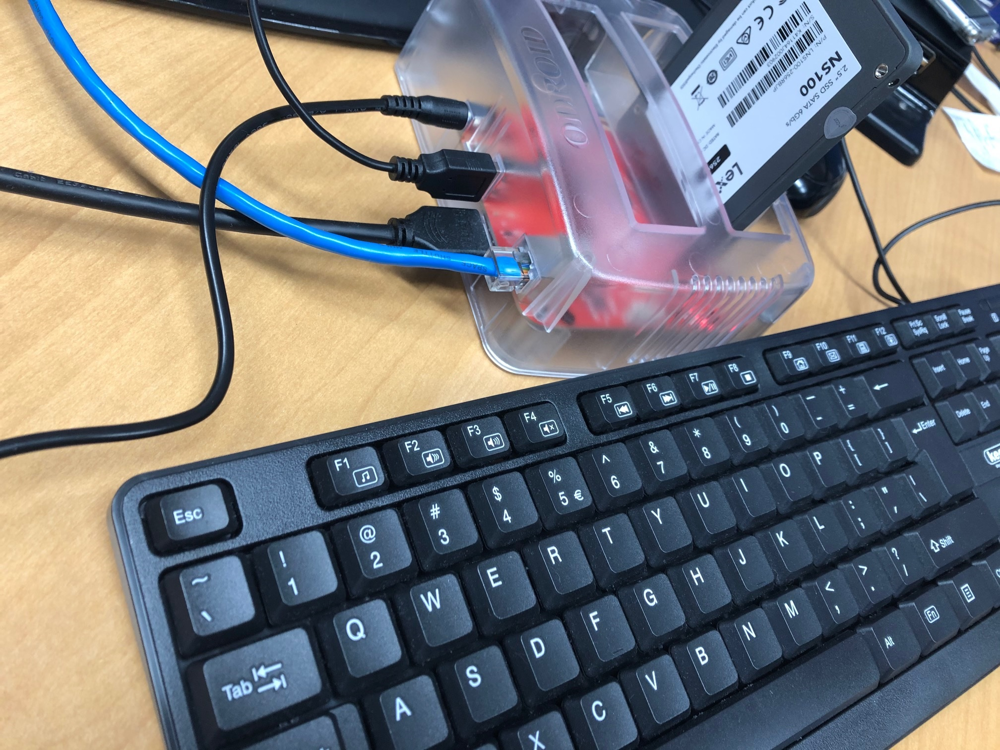

# odroidhc4-install
Ubuntu 20.04LTS installation on Aarch64 v8.2A Hardware(Hardkernel Odroid HC4) and some library setup.

## 1. Hardware preparation

YOU DON'T NEED SD Card/USB Memory TO BOOT! EXCELLENT!

- Hardkernel Odroid HC4 board https://www.hardkernel.com/shop/odroid-hc4/
- SATA 2.5inch SSD(maybe 256GByte or bigger)
- HDMI cable and Display
- AC/DC power adapter(choosing 15V/4A, but maybe ok for 2-3A)
- USB keyboard & mouse. Note only one USB3.0 port on HC4, USB hub is likely needed.
- Ether cable and public network connection.



## 2. Petiboot netboot and Ubuntu install

After power on, no netboot list is available in pepiboot menu. So you need to find netboot-able images from network using petiboot loader. This is done by the following command.
```
Choose  "Exit to shell"
(switch to console then)
# netboot_default
# exit
(back to petiboot menu)
```

Now you can see "net install-able" image list if your ether cable is correctly connected to network. In this example I'm choosing Ubuntu 20.04LTS. 
Assume you select appropriate setting in install procedure. 

| item     | setting |
|----------|---------|
| account  | accountmngr |
| pwd      | <as_u_like> |
| hostname | hc4armkk |

Total OS installation may take 1.0 hour. After installation, reboot system and start Ubuntu CLI.

## 3. Install applications & libs as root
Login in as accountmngr with password you set during Ubuntu installation. First thing you need to do is,

```
accountmngr@hc4armkk: sudo apt-get update -y
accountmngr@hc4armkk: sudo apt-get install -y  build-essential git
accountmngr@hc4armkk: sudo dpkg-reconfigure keyboard-configuration
accountmngr@hc4armkk: sudo sh -c "echo "hc4armkk" > /etc/hostname"
accountmngr@hc4armkk: sudo reboot
```

Then log-in again and let's run install_basic.sh script.
```
accountmngr@hc4armkk: mkdir -p ~/tmp && cd ~/tmp 
accountmngr@hc4armkk: git clone https://github.com/snakajim/odroidhc4-install
accountmngr@hc4armkk: cd odroidhc4-install/scripts 
accountmngr@hc4armkk: chmod +x * && sudo sh -c ./install_basic.sh
```

The script installs and sets basic environment for HC4.
- install gcc-7,8 and 10. Using gcc-8 as build tool.
- install basic apps used for build, such as cmake/java/pip3/ninja/aria2/z3, etc..
- avahi-daemon enabled, your hostname "hc4armkk" is accesable from local.
- at-daemon(atd) enabled.
- docker daemon enabled.
- user account "user0" is created with sudo authority. 

Some application does not recommend to install as root, so let's switch login account to "user0" and continue.

## 4. Install optional applications & libs as non-root user

HC4 hardware is broadcasting its hostname by mDNS avahi-daemon, so that you can reach the hardware just by hostname. To confirm mDNS is surely working, ping to HC4. 
```
$> ping hc4armkk
hc4armkk.local [fe80::35e:6cf:fe79:ce%3]に ping を送信しています 32 バイトのデータ:
fe80::35e:6cf:fe79:ce%3 からの応答: 時間 =3ms
fe80::35e:6cf:fe79:ce%3 からの応答: 時間 <1ms
fe80::35e:6cf:fe79:ce%3 からの応答: 時間 <1ms
fe80::35e:6cf:fe79:ce%3 からの応答: 時間 <1ms

fe80::35e:6cf:fe79:ce%3 の ping 統計:
    パケット数: 送信 = 4、受信 = 4、損失 = 0 (0% の損失)、
ラウンド トリップの概算時間 (ミリ秒):
    最小 = 0ms、最大 = 3ms、平均 = 0ms
```

To start with setting user0 profile, ssh connect to hc4armkk as root(accountmngr).
```
$> ssh accountmngr@hc4armkk
password: <as_u_like>
Welcome to Ubuntu 20.04.1 LTS (GNU/Linux 5.10.0-odroid-arm64 aarch64)

 * Documentation:  https://help.ubuntu.com
 * Management:     https://landscape.canonical.com
 * Support:        https://ubuntu.com/advantage
Last login: xx xx xx xx:xx:xx 20xx from xxx.xxx.xxx.xxx
accountmngr@hc4armkk:~$
```

Copy public key under /home/user0/.ssh from your host consol(powershell/PuTTY/xterm/etc..).
```
$> scp <your_public_key> accountmngr@hc4armkk:/tmp
```

SSH login as accountmngr@hc4armkk and add the public key to authorized key list to user0. After setting the public key, reboot.
```
accountmngr@hc4armkk:~$ sudo sh -c "cp <your_public_key> /home/user0/.ssh/<your_public_key> && cat <your_public_key> >> /home/user0/.ssh/authorized_keys"
accountmngr@hc4armkk:~$ sudo chown -R user0:user0 /home/user0 
accountmngr@hc4armkk:~$ sudo reboot
```

To make easy access from your remote development environment such as Microsoft VS Code, Teraterm or PuTTY, it is nice idea to modify ssh configulation file which is usually stored in ${HOME}/.ssh/config
```
Host hc4armkk
    HostName hc4armkk
    User user0
    Port 22
    IdentityFile ~/.ssh/<your_key_pair_name>
    ServerAliveInterval 120
    ServerAliveCountMax 60
    ForwardX11 yes
```

Now you are ready to ssh by short cut. 
```
$> ssh hc4armkk
(fingerprint check, etc... at first time)
Welcome to Ubuntu 20.04.1 LTS (GNU/Linux 5.10.0-odroid-arm64 aarch64)

 * Documentation:  https://help.ubuntu.com
 * Management:     https://landscape.canonical.com
 * Support:        https://ubuntu.com/advantage
Last login: xx xx xx xx:xx:xx 20xx from xxx.xxx.xxx.xxx
user0@hc4armkk:~$
```

Or choose "Remote SSH: Connect Host..." in VS Code Pull Down Window and select "hc4armkk" from the list. There are several articles in web about Remote SSH in VS Code, so please refer them as well. 

Once you can successfully login as user0, let's run sample scripts under odroidhc4-install/scripts.
```
user0@hc4armkk:~$ cd ~/tmp && git clone https://github.com/snakajim/odroidhc4-install && cd ~/tmp/odroidhc4-install/scripts
user0@hc4armkk:~$ ls *.sh
install_acl.sh  install_basic.sh  install_compiler.sh  install_lld.sh install_llvm.sh install_polly.sh run run_user0.sh
```

To batch running scripts, use run_user0.sh with at command for example.
```
user0@hc4armkk:~$ cd ~/tmp/odroidhc4-install/scripts
user0@hc4armkk:~$ echo "./run_user0.sh > /dev/null 2>&1" | at now
```

### 4-a. Install Arm Compute Library on aarch64 linux

#### 4-a-1. building ACL

There is a build issue with default compiler gcc. You need to change to gcc-8 or clang-11.01. To utilzie v8.2A NEON feature, plese do not forget to set "arch=arm64-v8.2-a" and "neon=1" in scons args. Installation may take 5-6 hours.
```
user0@hc4armkk: cd odroidhc4-install/scripts && source ./install_acl.sh
```

Using clang may generate warning in compilation, ie -Wno-deprecated-copy. To avoid build error due to warning, please set "Werror=0" in scons args or -Wno-deprecated-copy in ComputeLibrary/SConstruct manually. You can see more about scons args in manual.

- https://arm-software.github.io/ComputeLibrary/v20.11/index.xhtml#S3_how_to_build

Compile time varies in which tool chain you choose. Here is a quick benchmark.

```
scons Werror=0 debug=0 asserts=0 arch=arm64-v8.2-a os=linux neon=1 opencl=1 examples=1 build=native pmu=1 benchmark_tests=1 -j4
```

The latest LLVM tools, both clang-11 and lld-11, does not help for HC4 native compile speed. 
And if you rush to compile, x86_64 cross compile is the way. 

|env     | tool chain                           | user time(min) | ratio |
|--------|--------------------------------------|----------------|-------|
|native  | gcc-8 + ld                           | 288            |1.00   |
|native  | clang-11 + lld-11                    | 377            |1.30   |
|native  | gcc-8 + lld-11                       | 288            |1.00   |
|cross(*)| aarch64-none-linux-gnu-g++-10.2      | 79             |0.27   |
|native-RPi4-4G Ubuntu20.04  | gcc-8 + ld       | 237            |0.82   |
|native-RPi4-4G Ubuntu20.04  | clang-11 + lld-11| 312            |1.08   |
|native-KhadasVIM3-Pro Ubuntu20.04  | gcc-8 + lld-11| 198            |0.68   |
|native-KhadasVIM3-Pro Ubuntu20.04  | clang-11 + lld-11|             |   |

    
(*) CentOS7 Docker container on Windows 10 Pro, assigning Core i5 v-CPUx4. You can access same version of cross compiler from here.
- https://developer.arm.com/-/media/Files/downloads/gnu-a/10.2-2020.11/binrel/gcc-arm-10.2-2020.11-x86_64-aarch64-none-linux-gnu.tar.xz

#### 4-a-2. running tests given in ACL

- https://arm-software.github.io/ComputeLibrary/v20.11/tests.xhtml#tests_running_tests

To check the list of test vectors, 
```
user0@hc4armkk:~$ cd ComputeLibrary/build/test && \
export LD_LIBRARY_PATH=${PWD}/..:$LD_LIBRARY_PATH && \
./arm_compute_benchmark --help
```


### 4-b. Install LLVM1101(clang/clang++/libcxx/libcxxabi/lld/openmp) on aarch64 linux

There is a build issue with default compiler gcc. You need to change to gcc-8 or clang-11.01. LLVM build may take 5 hours. After install llvm, recommend to reboot.

```
user0@hc4armkk:~$ cd odroidhc4-install/scripts && source ./install_llvm.sh
```

Or if you need lld-11 only, 
```
user0@hc4armkk:~$ cd odroidhc4-install/scripts && source ./install_lld.sh
```


To enable clang/lld after install, set env params. Note "lld" is sometimes installed as "ld.lld" in Linux. 
```
user0@hc4armkk:~$ export LLVM_DIR=/usr/local/llvm_1101
user0@hc4armkk:~$ export PATH=$LLVM_DIR/bin:$PATH
user0@hc4armkk:~$ export LIBRARY_PATH=$LLVM_DIR/lib:$LIBRARY_PATH
user0@hc4armkk:~$ export LD_LIBRARY_PATH=$LLVM_DIR/lib:$LD_LIBRARY_PATH
user0@hc4armkk:~$ which lld  && lld --version
/usr/local/llvm_1101/bin/lld
lld is a generic driver.
user0@hc4armkk:~$ which ld && ld --version
/usr/bin/ld
GNU ld (GNU Binutils for Ubuntu) 2.34
```

For details about lld, see manual page. 
- https://lld.llvm.org/

#### 4-b-1. LLVM polly

Polly is a LLVM Framework for High-Level Loop and Data-Locality Optimizations. You can enable polly just parsing "-O3 -mllvm -polly" options. 

```
clang -O3 -mllvm -polly file.c
```

Runtime benchmark result To Be Measured.

### 4-c. Install arm baremetal compiler on aarch64 linux

Using "GNU Arm Embedded Toolchain Version 10-2020-q4-major" as example. You can check the latest version from here. 
- https://developer.arm.com/tools-and-software/open-source-software/developer-tools/gnu-toolchain/gnu-rm/downloads

```
user0@hc4armkk:~$ cd odroidhc4-install/scripts && source ./install_compiler.sh
```


## 5. Aarch64 v8.2A optimiztion tips

Coming later...

## 6. Docker private repository on Odroid HC4

The goal is to utilize Odroid HC4 board as docker private repository server in local network. 

### 6-a. Docker Enging installation on Aarch64 Ubuntu.20.04

Install the latest docker-ce on Ubuntu.20.04, detailed instruction is in docker docs.

- https://docs.docker.com/engine/install/ubuntu/

Or Ubuntu-20.04 has already prepared docker in repo, so use it.

```
user0@hc4armkk:~$ sudo apt-get install -y docker.io
user0@hc4armkk:~$ sudo gpasswd -a $USER docker
user0@hc4armkk:~$ sudo chmod 666 /var/run/docker.sock
```

Assume your install is done, make sure that docker.service daemon is hot and you can run hello-world without sudo permission.

```
user0@hc4armkk:~$  sudo systemctl status docker.service
● docker.service - Docker Application Container Engine
     Loaded: loaded (/lib/systemd/system/docker.service; disabled; vendor preset: enabled)
     Active: active (running)
     ....
user0@hc4armkk:~$ docker run hello-world
```

### 6-b. Start docker private registroy service  
Docker private registry service is using docker registry contaier provided by docker.

- https://hub.docker.com/_/registry/

Coming soon...

### 6-c. Testing to push/pull
Coming soon...

## 7. Arm License Server (FlexLM)
https://developer.arm.com/documentation/dui0209/j/setting-up-a-floating-license-server/starting-the-license-server

### 7-a. Request Arm license
Please contact license.support@arm.com for detail of acquiring Arm License.

Or refer this site : https://developer.arm.com/support/licensing

### 7-b. Download License Server Management Software(FlexNet Publisher)
Download FlexNet Publisher from Arm Product Download Hub
> https://developer.arm.com/tools-and-software/software-development-tools/license-management/downloads

Odroid HC4 is Arm Arch64, so please choose Linux AArch64 (armv8l) one to download.

### 7-c. Setting Up a Floating License Server
#### 7-c-1. Installing the server software
extract `BX002-PT-00010-r11p17-02rel0.tar.gz` which is downloaded from Arm Product Download Hub.
There will be several files extracted.
```
user0@hc4armkk:~$ cd <file download directory>
user0@hc4armkk:~/Downloads$ tar xzvf BX002-PT-00010-r11p17-02rel0.tar.gz
BX002-PT-00010-r11p17-02rel0/
BX002-PT-00010-r11p17-02rel0/rmlinks.sh
BX002-PT-00010-r11p17-02rel0/makelinks.sh
BX002-PT-00010-r11p17-02rel0/armlmd
BX002-PT-00010-r11p17-02rel0/lmgrd
BX002-PT-00010-r11p17-02rel0/fnp_LicAdmin.pdf
BX002-PT-00010-r11p17-02rel0/ReleaseNotes.pdf
BX002-PT-00010-r11p17-02rel0/armlmd.opt
BX002-PT-00010-r11p17-02rel0/armlmdiag
BX002-PT-00010-r11p17-02rel0/lmutil
```

Change to `BX002-PT-00010-r11p17-02rel0` directory and execute `makelinks.sh`
```
user0@hc4armkk:~/Downloads$ cd BX002-PT-00010-r11p17-02rel0/
user0@hc4armkk:~/Downloads/BX002-PT-00010-r11p17-02rel0 $ ./makelinks.sh
user0@hc4armkk:~/Downloads/BX002-PT-00010-r11p17-02rel0 $ l
armlmd*           lmborrow*  lmgrd*      lmremove*  lmswitchr*     ReleaseNotes.pdf
armlmdiag*        lmcksum*   lmhostid*   lmreread*  lmutil*        rmlinks.sh*
armlmd.opt        lmdiag*    lminstall*  lmstat*    lmver*
fnp_LicAdmin.pdf  lmdown*    lmpath*     lmswitch*  makelinks.sh*

```

move these files into `/usr/local/bin/`. (need root to write `/usr/local/bin/`)
```
user0@hc4armkk:~/Downloads/BX002-PT-00010-r11p17-02rel0 $ sudo mv * /usr/local/bin/
user0@hc4armkk:~/Downloads/BX002-PT-00010-r11p17-02rel0 $ ls /usr/local/bin/
armlmd      fnp_LicAdmin.pdf  lmdiag  lmhostid   lmremove  lmswitch   lmver             rmlinks.sh
armlmdiag   lmborrow          lmdown  lminstall  lmreread  lmswitchr  makelinks.sh
armlmd.opt  lmcksum           lmgrd   lmpath     lmstat    lmutil     ReleaseNotes.pdf
```

#### 7-c-2. Installing the server license
Make a directory to store your license.
```
user0@hc4armkk:~ $ mkdir ~/License
```

Move or download your Arm license into the license directory you just made.
Then open a text editor to modify your license.dat file.
Replace `this_host` in the license file with the corresponding server name.
And assign a port for access (we set port 27000 here)
> SERVER `hc4armkk` 001E064900CE `27000`

#### 7-c-3. Starting the license server
To start the license server software on a Unix/Linux server, go to the directory containing the license server software and type:
> nohup lmgrd -c `license_file_name` -l `logfile_name`
```
user0@hc4armkk:~/License $ nohup lmgrd -c license.dat -l lm.log
```

After you have started the license server, you can type the below to see the most recent output from the license server.
> tail -f `logfile_name`
```
user0@hc4armkk:~/License $ tail -f lm.log
```

In addition, you can type the below to check if the server up or not.
> lmutil lmstat
```
user0@hc4armkk:~/License $ lmutil lmstat
lmutil - Copyright (c) 1989-2020 Flexera. All Rights Reserved.
Flexible License Manager status on Fri 5/14/2021 14:00

License server status: 27000@hc4armkk
    License file(s) on hc4armkk: /home/user0/License/license.dat:

  hc4armkk: license server UP (MASTER) v11.17.2

Vendor daemon status (on hc4armkk):

    armlmd: UP v11.17.2

```

#### 7-c-4. Shutting down the license server
> lmutil lmdown -q -c `license_file_name`
``` 
user0@hc4armkk:~/License $ lmutil lmdown -q -c license.dat

```

### 7-d. Troubleshooting
a. Check whether deamon up or not
``` 
lmutil lmstat
``` 

b. Check whether process up or not (need root)
``` 
sudo lsof -i -P -n | grep LISTEN | grep armlmd
sudo lsof -i -P -n | grep LISTEN | grep lmgrd
``` 

c. Check whether acess is blocked by firewall or internet issue. 
> nc -vz `server ip` `port`
``` 
nc -vz hc4armkk.local 27000
``` 

If below error shows up
> Ncat: Connection refused.

> Ncat: No route to host.

Try to open the port of the firewall (root need)
> sudo firewall-cmd --add-port=`port` /tcp --permanent
```
user0@hc4armkk:~$ sudo firewall-cmd --add-port=27000/tcp --permanent
```

### 7-e. Client License Configuration 
https://developer.arm.com/documentation/dui0209/h/configuring-a-client-to-use-a-license-server?lang=en

#### 7-e-1. Linux (Shell)

If you are using csh or tcsh, you can set the environment variable for a single server as follows:

```
setenv ARMLMD_LICENSE_FILE <port>@<my_server>
```

If you are using bash or sh, an example would be:
```
ARMLMD_LICENSE_FILE=<port>@<my_server>
export ARMLMD_LICENSE_FILE
```

#### 7-e-2. Linux (.flexlmrc)

You can edit a file in your home directory called .flexlmrc in order to set up client licensing. To do this, add the following line to .flexlmrc:

> ARMLMD_LICENSE_FILE=value

where value is the value to which you want to set the environment variable, such as `port@my_server`.

#### 7-e-3. Windows
If you are using the Control Panel, then you can set the environment variable as follows:

1. Open the Control Panel by clicking on Start → Control Panel.
2. Double click on the System icon in the Control Panel. An easy way to find this icon is to change the Control Panel view to Classic View.
3. Click the Advanced tab in Windows 2000 or XP, or the Advanced system settings task in Vista, then click the Environment Variables button.
4. Create a new system environment variable, ARMLMD_LICENSE_FILE, and set its value. This must include valid port@server information. If a default port in the range between 27000 and 27009 is used on the server, then the port number is omitted in the environment variable. If you are using a single server floating license, you would set the environment variable value to something similar to: 8224@my_server If you are using a three server license, or wish to refer to more than one license server, you would set the environment variable value to something similar to: 8224@my_serverA;8224@my_serverB;@my_serverC The master server appears first, and in this example is my_serverA. The entry for my_serverC is not preceded by a port number because in this example a default port number is being used.

## Appendix Revision history
- v2.0: Add Arm License server installation
- v1.1: update for stability and multi-platform support(Win10 docker and RPi4 native), 2020-Jan-30
- v1.0: initial version, 2021-Jan-19
